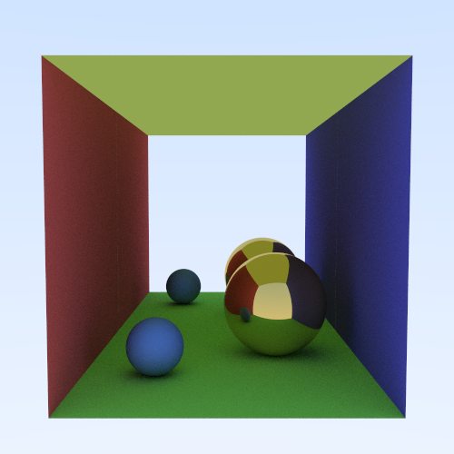
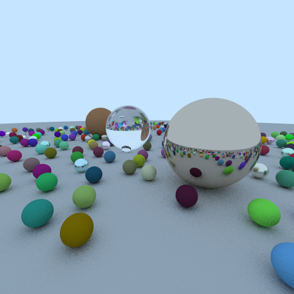
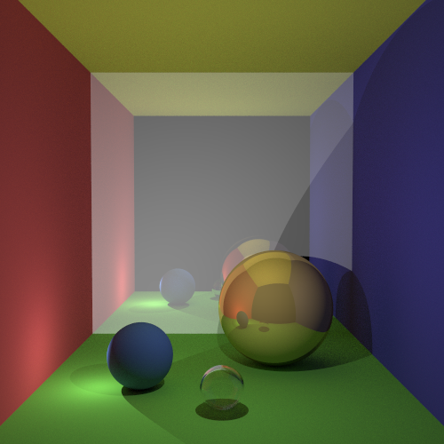

# Raytracer

A simple raytracer written in Go, based on the tutorial ["Ray Tracing in One Weekend"](http://www.realtimerendering.com/raytracing/Ray%20Tracing%20in%20a%20Weekend.pdf).

## Some output images

